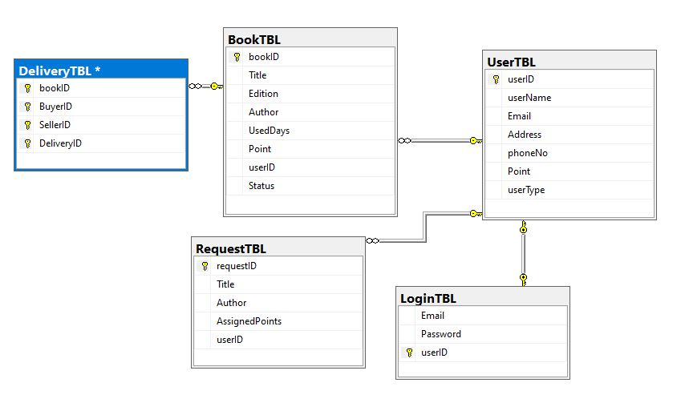

# Bookish
A book exchanging web platform, where users can swap and acquire or trade books from among themselves /n
via earning points through contributing to the policies \n

# DB

# Group
Md. Mohaimanul Haque  
Abdullah Shafi  
Souvik Das  
Zahir Mahmud Mihon  
# Snaps  
  

